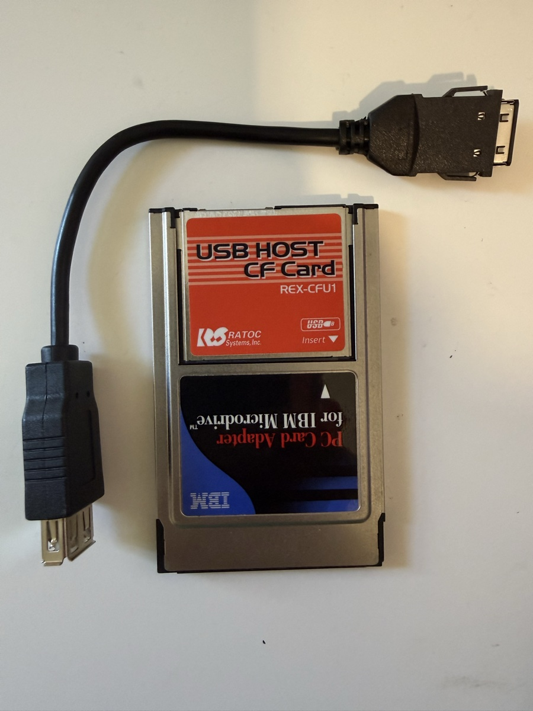

# cfu1-win9x

Windows 95/98 driver (and DOS tooling) for the **RATOC REX-CFU1 "USB HOST
CF+ Card"** — a CompactFlash-sized USB 1.1 host controller card built
around the Cypress/ScanLogic **SL811HS**. RATOC only ever shipped Windows
CE drivers for it; this project makes the card work on PCs.



*The REX-CFU1 with its USB-A dongle, seated in an IBM Microdrive
CF-to-PC-Card adapter — as tested in a ThinkPad 235.*

Current state: **USB mouse, USB keyboard, USB hubs, and a real
read/write drive letter for USB sticks, on Windows 98.** Insert the
card and Windows PnP-installs it (INF + CONFIGMG-integrated VxD,
auto-enabled at boot); plug in a USB mouse or keyboard — directly or
through a **self-powered hub** — at any time and a ring-0 hot-plug
supervisor enumerates it, classifies it, and feeds Windows via
VMOUSE/VKD: pointer, keys, typematic repeat, no commands. Keyboard and
mouse work **simultaneously behind a hub**, devices can be yanked and
replugged freely (per-port teardown and re-enumeration), a keyboard
always wins the primary slot regardless of enumeration order, and a
watchdog even recovers hubs whose firmware crashes (see roadmap).
The **input side — mouse, keyboard, hubs — is the solid part.**
There is also mass-storage support (the supervisor auto-mounts a USB
stick as a removable drive letter through the VxD's own IOS port
driver + TSD), but it is **strictly experimental and currently not
recommended for use at all** — see the warning below. The same VxD
exposes a full polled USB transfer engine (control + interrupt +
bulk) over a simple ioctl API.

> ## ⚠️ Mass storage is EXPERIMENTAL — do not use it right now
>
> This is a research driver, built by probing undocumented hardware and
> undocumented Windows internals on real machines. The mouse, keyboard,
> and hub support has held up well in daily testing. **The drive-letter
> (mass storage) support has not: we currently advise against using it
> at all, even for testing you consider disposable.** In recent testing,
> copying a folder of files onto the stick **blue-screened Windows with
> a file-corruption warning, and the machine had trouble coming back up
> afterwards.** Until that is found and fixed:
>
> * do not plug in any USB drive whose contents you would mind losing —
>   and don't trust files you copy *onto* one through this driver;
> * expect single small files to work and larger copies to be roulette
>   (small reads/writes verified byte-exact; bulk copies can crash the
>   whole machine — though the most recent fresh-boot folder copy did
>   complete without errors, modulo the UI freezing during I/O);
> * treat any machine running the storage path as a lab machine: hard
>   resets and boot-time scandisks are part of the experience.
>
> One storage milestone did just land: **hot-unplug now tears down
> properly** — pull the stick and E: disappears within a couple of
> seconds, an absent-media poke reports *not ready* (never "format?"),
> a mouse plugged in afterwards just works, and re-inserting the stick
> remounts it automatically.
>
> The interrupt-driven transfer engine on the roadmap is the intended
> cure for this class of problem; until it lands, storage stays in the
> "watch this space" column.

## Why no driver ever existed: the card's CIS lies

The card's CIS CONFIG tuple declares its configuration register at
attribute address **0xF8**. The real (and only) configuration register is
at attribute **0xFC** — writes to 0xF8 never latch. Any
standards-following host stack (Windows 9x PCCARD, Card Services, etc.)
writes the COR at the address the CIS declares, the card ignores it, and
the card stays dead. Every tool and driver here maps an attribute-memory
window and pokes 0xFC directly.

More hardware findings (verified on real hardware — an IBM PC110 under DOS
and a ThinkPad 235 under Windows 98) are documented in
[PROBE-NOTES.md](PROBE-NOTES.md), including:

* full CIS dump and decode; MANFID C015/0001; PnP ID
  `PCMCIA\RATOC-USB_HOST_CF+_CARD-57DD`
* address decode map (A0 = SL811 addr/data select, A1 = an unidentified
  latch, A2/A5–A7 ignored)
* SL811HS gotchas: the SOF timer is gated by INTENA bit 4; SOF generation
  needs the EP-A kickstart; the AFTERSOF host-control bit hangs non-
  full-speed transfers; the D+ speed-detect status bit is unreliable
  (probe full-speed first, fall back to low-speed + DSWAP)
* Windows 98 gotchas: VxDs must be linked dynamically loadable; ring-3
  hardware access is silently virtualized; the OS PCMCIA layer races
  socket enables and shuts down sockets with unserviced interrupts

## How the drive letter works (undocumented IOS findings)

Windows 9x block storage is the IOS (I/O Supervisor) stack: port driver
at the bottom, type-specific driver (DISKTSD) and volume tracker above,
VFAT on top. This driver registers as a dynamically-loaded port driver
(`IOS_Register`, `DRP_MISC_PD`) and everything below the TSD works as
documented: IOS sends `AEP_INITIALIZE` → `AEP_DEVICE_INQUIRY` →
`AEP_CONFIG_DCB`, the VxD enumerates the stick in ring 0, claims unit 0,
fills the DCB's actual geometry and splices its request routine into the
calldown. Then, three things the DDK does not tell you:

1. **DISKTSD never configures a dynamically-registered port driver's
   DCB.** The TSD layering pass only runs during boot-time
   configuration; register after boot and your DCB sits forever with
   `DCB_DEV_MUST_CONFIGURE` set — no partition scan, no drive letter.
   (Verified by dumping the DCB and its calldown chain against the boot
   HDD's, using the VxD's ring-0 peek ioctl.)
2. **Do not try to fix that with `ISP_BROADCAST_AEP`** of
   `AEP_CONFIG_DCB`: a layer driver deadlocks processing it, and the
   volume tracker assigns phantom drive letters A: through Z:.
3. The working approach: **be your own TSD.** The VxD reads the MBR in
   ring 0, parses partition 1, creates a logical volume DCB itself
   (`ISP_CREATE_DCB`; `DCB_Partition_Start`, geometry,
   `DCB_DEV_LOGICAL`), links it to the physical DCB, and calls
   `ISP_ASSOCIATE_DCB` — IFSMGR mounts the volume and the letter
   appears. The AER must acknowledge the mount-time AEPs (16–19,
   `DCB_LOCK`/`MOUNT_NOTIFY`/VRP create/destroy), the request routine
   must honour `IORF_LOGICAL_START_SECTOR` (volume-relative LBAs), and —
   the final trap — **`DCB_DEV_WRITEABLE` (0x02) must be set on both
   DCBs** or VFAT silently mounts the volume write-protected.

And the trap that cost two days: **a logical (memory-mapped) scatter-
gather list is not the SGD the DDK documents.** When an IOR carries
`IORF_SCATTER_GATHER`, `IOR_buffer_ptr` points at a null-terminated
list of `{ sector-count, linear-pointer }` pairs — *sector count
first*. The DDK's `SGD` struct (`{ pointer, byte-size }`) describes only
the *physical* variant. VFAT sends FAT and file-data writes scatter-
gather while directory writes come flat, so mis-reading the format
corrupts file contents while leaving directory listings perfect — a
maddening signature until an in-VxD trace ring dumped the raw list.

One more class of bug worth naming, because it bit three separate times:
the DDK block samples use registers freely, and IOS calls your AER and
request routine with live pointers in EBX/ESI. Every helper call that
touches the USB engine trashes them — save and restore around *every*
call, or enjoy page faults at addresses that took a map file to decode.

## Contents

```
dos/        DOS tools (build with Open Watcom 1.9+, 16-bit)
  CISDUMP.C   dump any PC Card's CIS via an 82365-compatible controller
  CFUPROBE.C  enable + identify + RAM test + detect + SOF + IRQ test
  CFUENUM.C   bus reset + GET_DESCRIPTOR control transfer (needs CFUPROBE)
win/        Windows 95/98 driver + diagnostic
  vxd/CFU1.ASM   dynamically loadable VxD: ring-0 socket enable (with the
                 COR-at-0xFC quirk), SL811 register/attr access ioctls,
                 VPICD IRQ hook
  diag/CFUDIAG.C Win32 console diagnostic: /ENUM /DETECT /SOF /IRQ /IDS
                 /LIVE /PCIC and more; loads the VxD from its own directory
  diag/CSTAT.C   supervisor + hub status at a glance: state machine, slot
                 bindings, per-port wPortStatus, parked mask
  diag/CHUBT.C   hub interrogator: address sweep (dead engine vs dead
                 hub), /REENUM clean re-enumeration with per-step SL811
                 error decode, /WATCH bus-presence oscilloscope
  CFU1.INF       PnP install stub with the verified hardware ID
  build.sh       cross-build on macOS (Open Watcom v2 + JWasm)
  get-ddk.sh     fetch the Windows 98 DDK includes and patch them for JWasm
  dist/          ready-to-run binaries
```

## Building

The Windows binaries cross-build on a modern machine — no retro toolchain
required on the target:

1. Install [Open Watcom v2](https://github.com/open-watcom/open-watcom-v2)
   (the snapshot tarball includes native macOS/Linux binaries) and build
   [JWasm](https://github.com/Baron-von-Riedesel/JWasm).
2. `win/get-ddk.sh` — downloads the Windows 98 DDK from the Internet
   Archive and extracts + patches the VMM/VPICD/etc. includes for JWasm
   (they are Microsoft-copyrighted, so they are not in this repo; the
   patch pipeline is verified byte-reproducible).
3. `win/build.sh` — produces `CFU1.VXD` and `CFUDIAG.EXE`.

The DOS tools build on any DOS box with Open Watcom
(`wcc -ms` + `wlink system dos`).

## Using it on Windows 98

Copy `win/dist/CFU1.VXD` and `CFUDIAG.EXE` to the same directory on the
target machine, insert the card, and:

```
CFUMOUSE /AUTO       enable the hot-plug supervisor: any USB mouse
                     plugged into the card just works (this is also
                     armed automatically at boot once the INF-installed
                     driver starts, so normally you never run anything)
CFUMOUSE /NOAUTO     disable the supervisor
CFUMOUSE /VMOUSE     one-shot: enumerate + arm the ring-0 pointer feed
CFUMOUSE /STOP       stop the pointer feed

CFUDIAG /CONF        show the PnP state (assigned resources, COR fix)
CFUDIAG /DETECT      enable the card, identify the SL811, test its RAM,
                     report whether a USB device is attached
CFUDIAG /ENUM2       full enumeration: SET_ADDRESS, descriptors, VID/PID,
                     config parse, SET_CONFIGURATION
CFUDIAG /HID n       stream interrupt-IN reports from endpoint n
CFUDIAG /IDS         list the PC Card PnP IDs Windows has recorded
CFUDIAG /OFF         power the socket down
```

`CFUDIAG /SOCKET n`, `/BASE hex`, `/WIN hex` select other sockets, I/O
bases, and attribute-window addresses. See TEST-ON-98.md and the source
for the full switch list.

Hub debugging:

```
CSTAT                supervisor state + hub ports + slot bindings in one
                     line each (reads CFU_AUTOSTAT and CFU_HUBSTAT)
CHUBT                who answers where: control-transfer address sweep +
                     SL811 register snapshot
CHUBT /REENUM        stop the supervisor, bus-reset, and re-enumerate the
                     hub step by step with raw error decode (STALL / NAK /
                     TIMEOUT per stage); /REENUM n also powers port n and
                     watches its status; /REENUM /NOPOWER stops short of
                     port power
CHUBT /WATCH         sample live bus presence (D+) at 100 ms for 4 s —
                     catches power-cycle oscillation of overloaded hubs
```

For the drive letter (⚠️ see the proof-of-concept warning above):

```
CFUDRV               with a USB stick in the card: registers the VxD
                     with IOS, mounts the stick in ring 0, creates the
                     logical volume and associates it -> E: appears,
                     read/write. Run once per boot; shut down (don't
                     yank) to remove.
CPEEK <hexaddr> [n]  hexdump linear memory through the VxD (ring 0)
CPEEK E              enumerate all of IOS's DCBs
```

## Status / roadmap

- [x] Hardware reverse engineering (CIS quirk, decode map, SL811 errata)
- [x] DOS proof: enable, SOF, IRQ delivery, control transfers
- [x] Win98 VxD: ring-0 enable, register access, IRQ hook, ioctl API
- [x] Win98 proof: device descriptor read through the VxD
- [x] PnP INF + CONFIGMG integration: auto-install, auto-enable at boot,
      Windows-assigned resources (COR quirk applied in CONFIG_START)
- [x] Ring-0 transfer engine (control + interrupt transfers, NAK retry,
      data toggles, full enumeration, HID report streaming)
- [x] USB mouse driver: ring-0 VMOUSE injection, movement + 3 buttons,
      survives app exit
- [x] Hot-plug auto-mouse supervisor: works from boot with zero commands,
      unplug/replug safe
- [ ] Mouse wheel (report-protocol parse + ring-3 helper; Win98's VMOUSE
      service has no Z axis)
- [x] USB keyboard: ring-0 VKD_Force_Keys injection, HID→scan-code
      translation, report diffing, typematic synthesis; the supervisor
      auto-classifies keyboard vs mouse vs disk vs hub from the config
      descriptor — everything arms itself
- [x] USB mass storage: Bulk-Only Transport + SCSI, reads a USB stick's
      sectors/partitions/FAT directory (CFUDISK, ring-3 over the VxD's
      bulk-transaction ioctl — verified reading files off a FAT32 drive)
- [x] **USB hubs** (self-powered ones): full ring-0 hub descent — hub
      descriptor, per-port power, reset, downstream enumeration at
      per-port addresses — plus a continuous port supervisor: hot-plug
      a device into any hub port and it arms in seconds, yank it and
      just that slot tears down. **Keyboard + mouse work simultaneously**
      (keyboard on the primary stateful slot, mouse on slot B), and a
      keyboard arriving late demotes a mouse that won the enumeration
      race. A watchdog detects the cheap-hub failure mode where the
      hub's firmware crashes (control endpoint goes mute while the
      repeater keeps forwarding) and revives it with a bus reset.
- [x] Bus-powered hubs: **ruled out by physics, with measurements.** The
      CF slot supplies roughly one 100 mA device; a hub must feed its
      controller plus 100 mA per powered port from that same budget. An
      Apple keyboard hub enumerates fine and then browns out the instant
      its downstream port power switches on; an unpowered USB 3 hub
      can't even boot its own controller (caught oscillating at ~500 ms
      alive / ~1.2 s dead by CHUBT /WATCH). The same USB 3 hub on a
      bench supply draws 40 mA on its own rail and works perfectly —
      externally powered hubs are the supported path.
- [ ] Hub status-change interrupt endpoint: replace the periodic port
      GET_STATUS polling (the traffic that provokes cheap-hub firmware
      crashes — currently just throttled to 1 port/s) with the hub's
      own interrupt IN pipe, which NAKs until a port changes
- [ ] Low-speed devices behind a full-speed hub: the PRE-preamble path
      is implemented but has never met real LS hardware
- [x] **Mass storage → real drive letter**: the VxD is an IOS port
      driver *and* its own TSD — mounts a USB stick as a read/write
      Windows drive letter (verified: DIR, TYPE, file creation through
      VFAT on a 16 GB FAT32 stick)
- [x] Auto-arm at boot / hot-insert: the supervisor classifies the
      attached device (config descriptor) and brings the volume up at
      appy time - no commands needed
- [~] Byte-exact reads **and writes** through VFAT for small operations:
      the request routine honours both LBA conventions (absolute and
      volume-relative) and walks Win9x logical scatter-gather lists,
      whose entries are `{sector-count, linear-pointer}` - *not* the
      `{pointer, byte-size}` of the DDK's documented (physical) SGD.
      Mis-reading that format was the whole two-day data-corruption
      saga. **But bulk operations are NOT trustworthy: a folder copy
      has blue-screened Windows with a file-corruption warning — see
      the warning at the top. Storage is currently not recommended for
      any use.**
- [x] Removable-drive lifecycle: removable/write-through presentation,
      CFUEJECT (+ /UP remount), and **working hot-unplug teardown** -
      pull the stick and E: vanishes, absent-media pokes say *not
      ready*, a mouse inserted afterwards enumerates, re-inserting the
      stick remounts. (Root cause was a one-liner: the ring-0 mount
      stopped the hot-plug supervisor to own the chip and nothing ever
      resumed it, so the detach detector never ticked. A watchdog now
      also force-frees the transfer engine if an error path leaks the
      busy guard.) The bulk-copy stability question above remains the
      reason storage stays experimental.
- [x] IRQ delivery under Windows: confirmed on the Windows-assigned
      IRQ 15 (VPICD hook + PCIC steering, ~1400 SOF interrupts/s in the
      canned CFU_IRQTEST) — with the hard-won rule that an IRQ handler
      and the polled engine must never share the chip (the SL811's
      address latch is write-only), so interrupts stay parked until the
      async engine owns all chip access
- [ ] Interrupt-driven transfer engine on IRQ 15: replaces the
      synchronous ring-0 PIO that freezes the UI during copies
      (currently mitigated by a 4 KB transfer cap); design in
      win/ASYNC-ENGINE.md

### On not using Microsoft's USB stack

Windows 98 *does* have a full WDM USB stack (`USBD.SYS`, `USBHUB.SYS`,
the HID class drivers), and its HID input shims feed the very same
VMOUSE/VKD services this driver injects into. We can't ride it: the whole
stack sits on top of a host-controller driver (`OPENHCI.SYS` /
`UHCD.SYS`) bound to `USBD.SYS` through the undocumented, internal HCDI
interface, and there is no SL811 HCD nor a documented way to write one.
Period third-party USB stacks for 9x (e.g. OrangeWare's) shipped
parallel to Microsoft's for the same reason. So this driver is its own
small USB stack by necessity, not preference. The full analysis is in
[docs/why-not-the-windows-usb-stack.pdf](docs/why-not-the-windows-usb-stack.pdf).

- [ ] **(research)** WDM HCD for the SL811: reverse the HCDI so the card
      plugs into Microsoft's own USB/HID/USBSTOR stack — would make hubs,
      device coexistence, and mass storage "free", but it's a hard RE
      project with real risk. The pragmatic hub + mass-storage work above
      reaches the same user-visible goals without it.

## References

* Cypress SL811HS datasheet (38-08008) and the Linux `sl811-hcd` /
  `sl811_cs` drivers — the reference implementations for this chip
* [RATOC's CFU1U FAQ](http://www.ratocsystems.com/english/support/faq/cfu1u.html)

## License

MIT — see [LICENSE](LICENSE).
